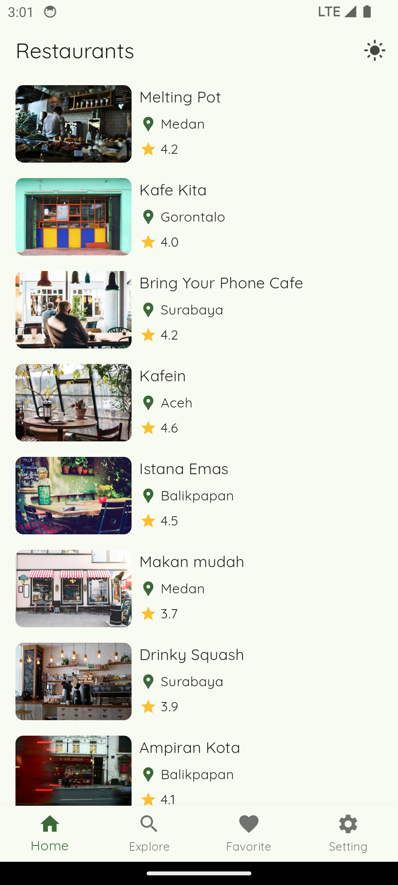
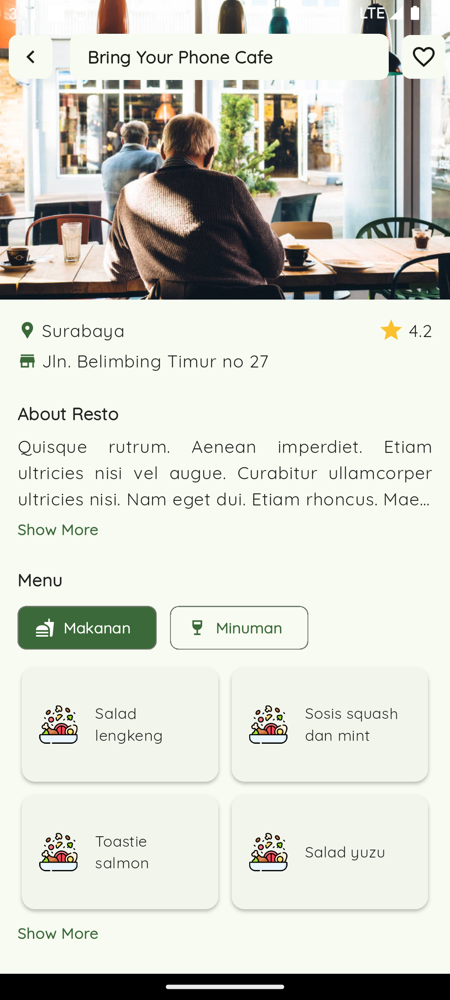
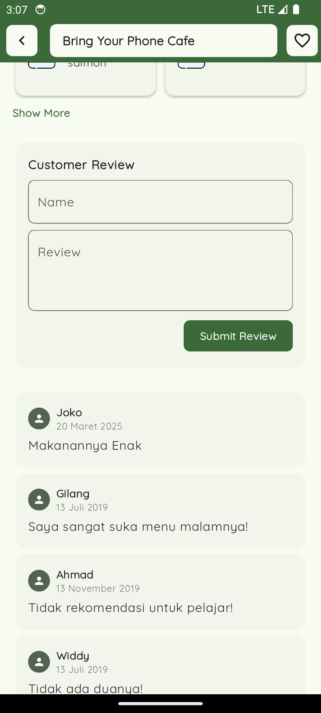
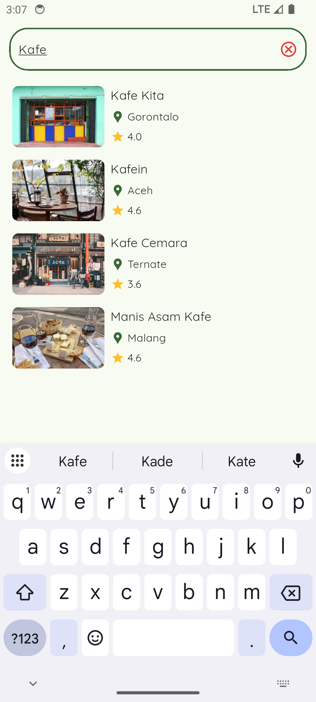
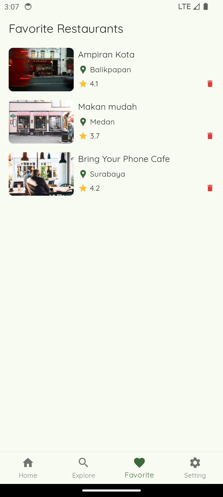
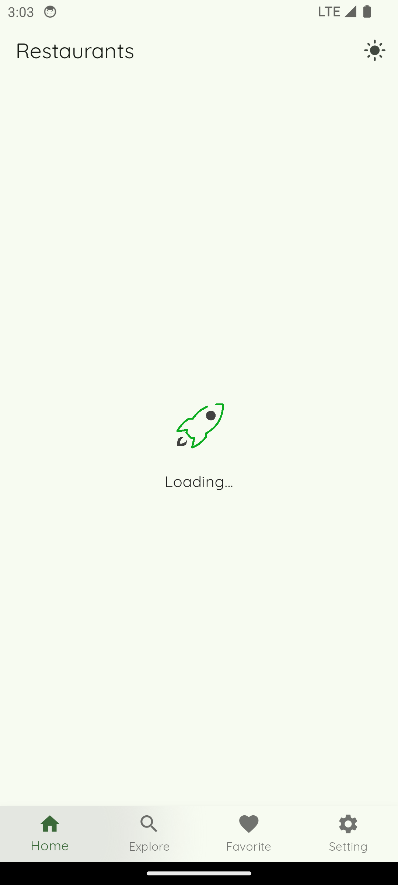
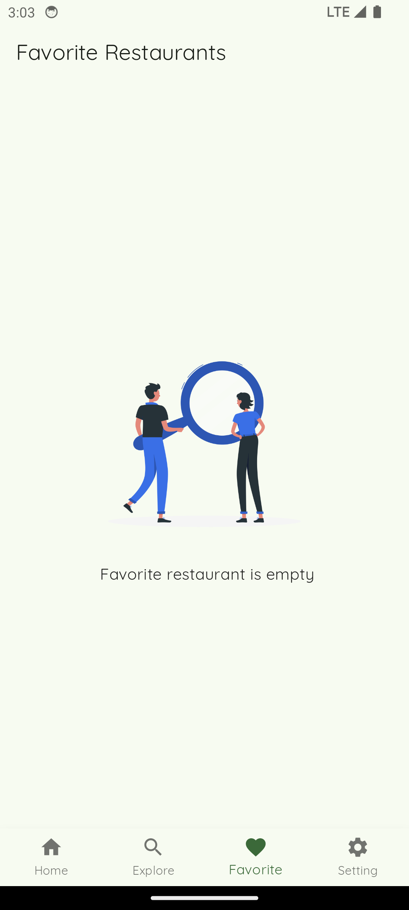
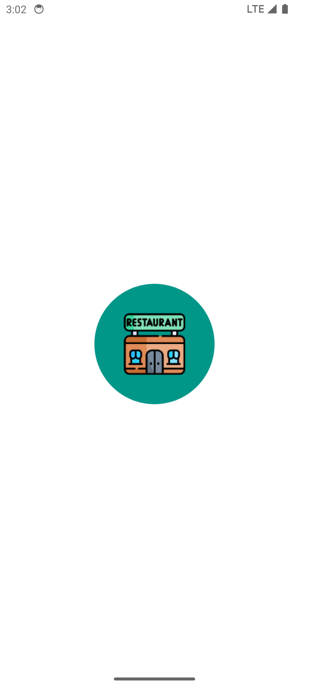

# Resto App

A Flutter-based restaurant application that allows users to browse restaurants, view details, and manage favorites. This project is part of my final submission for IDCamp 2024.

## Features

- Browse restaurant list
- View restaurant details
- Add and remove favorites
- Local notifications
- Dark mode support
- Offline data storage
- Background scheduling with WorkManager

## Tech Stack

- **Flutter**
- **State Management**: Provider
- **Networking**: HTTP package
- **Local Storage**: SQFlite & Shared Preferences
- **UI Enhancements**: Google Fonts & Lottie Animations
- **Background Tasks**: WorkManager & Flutter Local Notifications

## Installation

1. Clone the repository:
   ```sh
   git clone https://github.com/dianprsty/resto_app.git
   ```
2. Navigate to the project directory:
   ```sh
   cd resto_app
   ```
3. Install dependencies:
   ```sh
   flutter pub get
   ```
4. Run the application:
   ```sh
   flutter run
   ```

## Screenshots

| Home Screen                                | Restaurant Details                       | Restaurant Detail                         |
| ------------------------------------------ | ---------------------------------------- | ----------------------------------------- |
|  |  |  |

| Search Screen                                  | Setting Screen                           | Favorite Screen                                    |
| ---------------------------------------------- | ---------------------------------------- | -------------------------------------------------- |
|  |  |  |

| Loading Screen                                | Empty Screen                            | Splash Screen                            |
| --------------------------------------------- | --------------------------------------- | ---------------------------------------- |
|  |  |  |

## Contributions

Contributions are welcome! Feel free to fork this repository and submit a pull request.

## License

This project is licensed under the MIT License.

---
